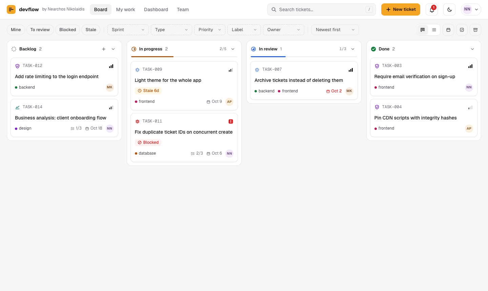
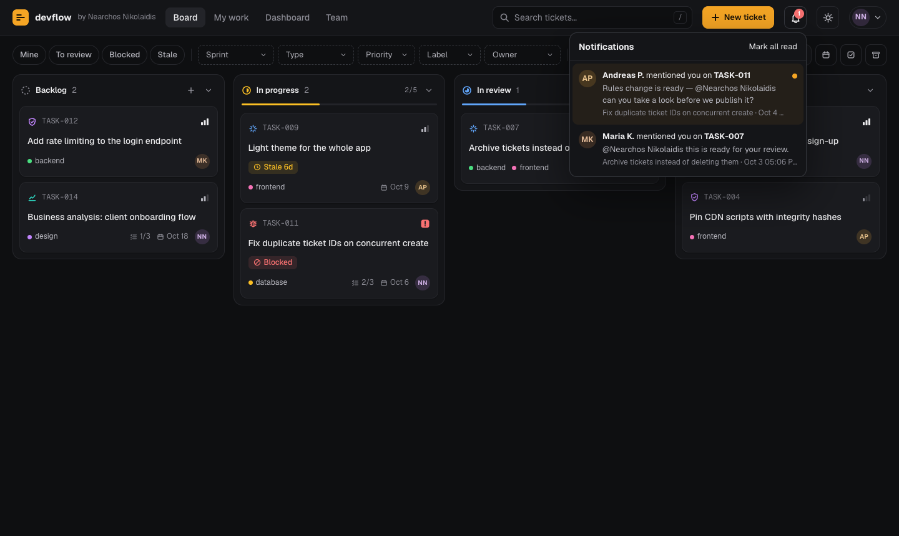
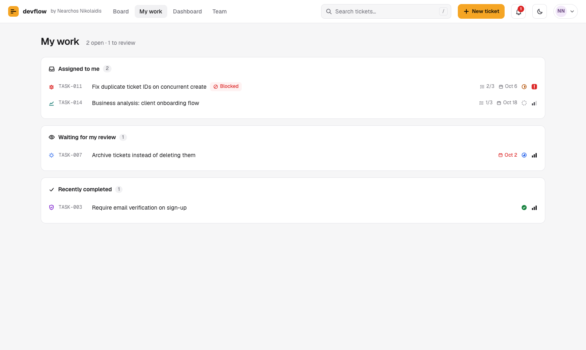

# Using devflow

This guide is for everyone on the team. It covers getting in, the board,
how a ticket moves from idea to done, and the features that keep work
visible. If you're setting devflow up for a team, start with
[SETUP.md](SETUP.md) instead.

---

## 1. Getting in

1. Open the board's address (your admin will share it) and choose **Create account**.
2. Use your work email and a password of at least 10 characters.
3. Check your inbox for a confirmation link, click it, then return and press **I've confirmed it — continue**. (Look in spam if it doesn't arrive within a few minutes.)
4. Press **Request access**. An admin approves you from the Team tab; reload the page once they have.

Forgot your password? Type your email on the sign-in screen and choose **Forgot password?**

You can change your password, profile and theme from the avatar menu in the top-right corner.

---

## 2. Roles

| | Developer | Project manager | Admin |
|---|:-:|:-:|:-:|
| See everything, create and edit tickets, comment | ✓ | ✓ | ✓ |
| Close a ticket (move it to Done) | as a reviewer who isn't the owner | ✓ | ✓ |
| Archive and restore tickets, hide comments | | ✓ | ✓ |
| Create and manage sprints | | ✓ | ✓ |
| Permanently delete archived tickets | | | ✓ |
| Approve people, change roles, board settings | | | ✓ |

These permissions are enforced by the database, so they hold no matter
what browser or tool someone uses.

---

## 3. The board



Four columns, left to right: **Backlog → In progress → In review → Done**.

- **Move a ticket** by dragging its card, or open it and pick a stage at the top of the panel.
- **Open a ticket** by clicking its card. It opens in a side panel so the board stays in view.
- **Quick edit** (the pencil on a card) changes type, priority, owner and labels without opening the full form.
- **Select** lets you pick several cards to move or archive at once.
- **Table** shows the same tickets as a sortable list (click a column header to sort).

### Reading a card

| You see | It means |
|---|---|
| Icon before the ID | The ticket's type (bug, feature, task…) |
| Bars on the right | Priority: one bar low, two medium, three high; a red **!** is critical |
| Coloured dots | Labels (topic areas such as frontend or backend) |
| `2/5` with a list icon | Checklist progress in the description |
| Calendar date | Due date — red when it's overdue |
| **Blocked** | Someone flagged it as blocked; hover to see why |
| **Stale 6d** | In progress or in review with no activity for that many days |
| `2/5` in a column header | Work-in-progress limit: 2 tickets against a limit of 5. The column turns red when it's over. |

### Finding tickets

- **Search** (or press `/`) matches titles and IDs.
- **Quick filters**: *Mine*, *To review* (tickets waiting for your review), *Blocked*, *Stale*.
- **Filters**: Sprint, Type, Priority, Label, Owner — an active filter is outlined in the accent colour.
- **Archived** shows archived tickets alongside the rest.

---

## 4. Creating a ticket

Press **New ticket** (or `N`).

1. **Start from a template** — Task, Bug report, Feature request, Security issue, Maintenance task, Business analysis or Research. A template sets the type and priority and fills in a structured description; everything stays editable.
2. Give it a clear **title**.
3. Fill in the **description**. Simple formatting works:

   | Type this | You get |
   |---|---|
   | `## Steps to reproduce` | a heading |
   | `- item` | a bullet |
   | `1. step` | a numbered step |
   | `- [ ] task` | a checkbox you can tick in the ticket |
   | `**important**` | **bold** |
   | `` `code` `` | `code` |

4. Set **type, priority, due date, owner, sprint, reviewers** (up to 5) and **labels**.

New tickets always start in Backlog and get the next number (TASK-001, TASK-002, …).

---

## 5. The workflow

```
Backlog ──▶ In progress ──▶ In review ──▶ Done
                               │             ▲
                     needs a reviewer        │
                                   a reviewer (not the owner),
                                   a PM or an admin closes it
```

- **In review** needs at least one reviewer on the ticket.
- **Done** can be set by any of the ticket's reviewers *who isn't also its owner*, or by a project manager or admin. You can't review and close your own work.
- If your team uses a **Definition of Done** (a short checklist your admin sets, such as "Tests added" and "Docs updated"), every item must be ticked in the ticket before anyone — admins included — can move it to Done.
- When a move isn't allowed, the stage button shows a lock; hover over it to see why.

### Blocked tickets

If you're stuck waiting on something, open the ticket and choose **Mark blocked**, then say why. The card shows a red *Blocked* badge, the dashboard lists it, and Discord is told. Choose **Unblock** when you can continue.

### Archiving

Admins and PMs can **Archive** a ticket instead of deleting it. It disappears from the board and dashboard but keeps its comments and history, and can be **restored** at any time.

---

## 6. Comments, @mentions and notifications

- Type in the comment box at the bottom of a ticket and press **Comment** (or `⌘/Ctrl + Enter`).
- **Mention someone** by typing `@` and picking a teammate. They get a notification under the **bell** in the top bar (and in Discord, if your team uses it). Mentions of you are highlighted.
- You can **edit** your own comments; they show "edited".
- PMs and admins can **hide** a comment that shouldn't be there.



Every change to a ticket — creation, moves, reviewer and owner changes, edits, blocking, archiving — is recorded in its **Activity** tab. Nobody can edit or delete those entries.

---

## 7. Sprints

PMs and admins create sprints with **Sprints** on the board toolbar: a name, an optional goal, start and end dates, and a status (*Planned*, *Active* or *Closed*).

- Plan a ticket into a sprint from its form (**Sprint** field). When the board is filtered to a sprint, new tickets go into it automatically.
- Filter the board with **Sprint → Current: …** to see just the sprint's work.
- The **Dashboard** shows the active sprint's goal, dates, days left and progress.

---

## 8. My work and the dashboard



- **My work** lists tickets assigned to you (blocked and high-priority first), tickets waiting for your review, and what you finished recently.
- **Dashboard** shows open, in-progress, overdue, blocked and stale counts, the active sprint, breakdowns by status, type and priority, a *Needs attention* list, and each person's workload.

---

## 9. Your profile

From the avatar menu → **My profile**, set your name, job title, status (*Available*, *Busy* or *Away*), bio and time zone. Teammates see your status in pickers and your local time on your profile — handy across time zones.

---

## 10. Keyboard shortcuts

| Keys | Does |
|---|---|
| `/` | Search tickets |
| `N` | New ticket |
| `G` then `B` / `M` / `D` / `T` | Go to Board / My work / Dashboard / Team |
| `Esc` | Close a panel, dialog or menu |
| `⌘/Ctrl + Enter` | Post a comment |
| `?` | Show all shortcuts |

---

## 11. For admins: the Team tab

- **Pending requests** — approve (choose a role) or deny people who asked for access.
- **Team members** — change roles, view profiles, remove people. Removing someone cuts their access immediately.
- **Board settings**
  - *Discord webhook* — where notifications go (paste it, **Send test**, **Save**)
  - *Stale after* — days without activity before a ticket is flagged
  - *Labels* — add, rename, recolour or remove the topic labels
  - *Definition of Done* — the checklist every ticket must complete before Done (leave empty to turn it off)
  - *Work-in-progress limits* — per column, 0 for no limit
  - *Weekly Discord summary* — a Monday-morning recap of the week (needs the one-time setup in [SETUP.md](SETUP.md#11-optional-weekly-discord-summary))
