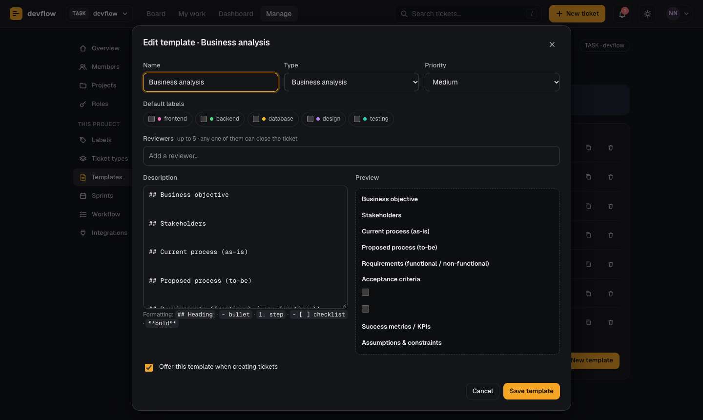

# Using devflow

This guide is for everyone on the team. It covers getting in, projects
and roles, the board, how a ticket moves from idea to done, the features
that keep work visible, and the Manage area. If you're setting devflow up for a team, start with
[SETUP.md](SETUP.md) instead.

---

## 1. Getting in

1. Open the board's address (your admin will share it) and choose **Create account**.
2. Use your work email and a password of at least 10 characters.
3. Check your inbox for a confirmation link, click it, then return and press **I've confirmed it — continue**. (Look in spam if it doesn't arrive within a few minutes.)
4. Press **Request access**. An admin approves you in **Manage → Members** and adds you to a project; the page opens devflow by itself as soon as they do.

Forgot your password? Type your email on the sign-in screen and choose **Forgot password?**

You can change your password, profile and theme from the avatar menu in the top-right corner.

---

## 2. Projects and roles

devflow is organised into **projects**. Each project has its own board,
ticket IDs (`WEB-001`, `APP-001`…), sprints, labels, ticket types,
templates, workflow settings and Discord channel. Switch projects from
the menu next to the logo (or press `P`). You only see projects you're a
member of.

In each project you have a **role**. The built-in roles are:

| | Viewer | Developer · QA · Designer | Tech lead | Project manager |
|---|:-:|:-:|:-:|:-:|
| See the project's tickets | ✓ | ✓ | ✓ | ✓ |
| Comment and @mention | ✓ | ✓ | ✓ | ✓ |
| Create, edit and move tickets | | ✓ | ✓ | ✓ |
| Close any ticket (move to Done) | | as a reviewer who isn't the owner | ✓ | ✓ |
| Archive tickets, hide comments | | | ✓ | ✓ |
| Sprints, labels, types, templates | | | ✓ | ✓ |
| Workflow, members, Discord | | | | ✓ |
| Request new projects | | | | ✓ |

**Workspace admins** can do everything in every project, create projects,
approve people and project requests, and edit the roles themselves —
rename them, change their permissions, or add new ones such as
*DevOps engineer*. Only admins can permanently delete archived tickets.

Everything in this table is enforced by the database, so it holds no
matter what browser or tool someone uses.

---

## 3. The board


Four columns, left to right: **Backlog → In progress → In review → Done**.

- **Move a ticket** by dragging its card, or open it and pick a stage at the top of the panel.
- **Open a ticket** by clicking its card. It opens in a side panel so the board stays in view.
- **Quick edit** (the pencil on a card) changes type, priority, owner and labels without opening the full form.
- **Select** lets you pick several cards to move or archive at once.
- **Table** shows the same tickets as a sortable list (click a column header to sort).

### Reading a card

| You see | It means |
|---|---|
| Icon before the ID | The ticket's type (bug, feature, task…) |
| Bars on the right | Priority: one bar low, two medium, three high; a red **!** is critical |
| Coloured dots | Labels (topic areas such as frontend or backend) |
| `2/5` with a list icon | Checklist progress in the description |
| Calendar date | Due date — red when it's overdue |
| **Blocked** | Someone flagged it as blocked; hover to see why |
| **Stale 6d** | In progress or in review with no activity for that many days |
| `2/5` in a column header | Work-in-progress limit: 2 tickets against a limit of 5. The column turns red when it's over. |

### Finding tickets

- **Search** (or press `/`) matches titles and IDs.
- **Quick filters**: *Mine*, *To review* (tickets waiting for your review), *Blocked*, *Stale*.
- **Filters**: Sprint, Type, Priority, Label, Owner — an active filter is outlined in the accent colour.
- **Archived** shows archived tickets alongside the rest.

---

## 4. Creating a ticket

Press **New ticket** (or `N`).

1. **Start from a template** — Task, Bug report, Feature request, Security issue, Maintenance task, Business analysis, Research, or any your project has added. A template sets the type and priority, can add default labels and reviewers, and fills in a structured description; everything stays editable.
2. Give it a clear **title**.
3. Fill in the **description**. Simple formatting works:

   | Type this | You get |
   |---|---|
   | `## Steps to reproduce` | a heading |
   | `- item` | a bullet |
   | `1. step` | a numbered step |
   | `- [ ] task` | a checkbox you can tick in the ticket |
   | `**important**` | **bold** |
   | `` `code` `` | `code` |

4. Set **type, priority, due date, owner, sprint, reviewers** (up to 5) and **labels**.

New tickets always start in Backlog and get the project's next number (for a project with key `WEB`: WEB-001, WEB-002, …).

Templates belong to the project, so each team can have its own. Anyone
whose role can manage content can edit them in **Manage → Templates**, or
turn an existing ticket into one with **Save as template** in its panel.

---

## 5. The workflow

```
Backlog ──▶ In progress ──▶ In review ──▶ Done
                               │             ▲
                     needs a reviewer        │
                                   a reviewer (not the owner), or a
                                   role allowed to close tickets
```

- **In review** needs at least one reviewer on the ticket.
- **Done** can be set by any of the ticket's reviewers *who isn't also its owner*, or by someone whose role can close tickets (Project manager and Tech lead by default) or a workspace admin. You can't review and close your own work.
- If your project uses a **Definition of Done** (a short checklist set in **Manage → Workflow**, such as "Tests added" and "Docs updated"), every item must be ticked in the ticket before anyone — admins included — can move it to Done.
- When a move isn't allowed, the stage button shows a lock; hover over it to see why.

### Blocked tickets

If you're stuck waiting on something, open the ticket and choose **Mark blocked**, then say why. The card shows a red *Blocked* badge, the dashboard lists it, and Discord is told. Choose **Unblock** when you can continue.

### Archiving

Roles that can archive (Project manager and Tech lead by default) can **Archive** a ticket instead of deleting it. It disappears from the board and dashboard but keeps its comments and history, and can be **restored** at any time.

---

## 6. Comments, @mentions and notifications

- Type in the comment box at the bottom of a ticket and press **Comment** (or `⌘/Ctrl + Enter`).
- **Mention someone** by typing `@` and picking a member of the project. They get a notification under the **bell** in the top bar (and in Discord, if your team uses it). Mentions of you are highlighted.
- You can **edit** your own comments; they show "edited".
- Roles that can moderate comments can **hide** one that shouldn't be there.


Every change to a ticket — creation, moves, reviewer and owner changes, edits, blocking, archiving — is recorded in its **Activity** tab. Nobody can edit or delete those entries.

---

## 7. Sprints

Roles that can manage sprints create them with **Sprints** on the board toolbar (it opens **Manage → Sprints**): a name, an optional goal, start and end dates, and a status (*Planned*, *Active* or *Closed*).

- Plan a ticket into a sprint from its form (**Sprint** field). When the board is filtered to a sprint, new tickets go into it automatically.
- Filter the board with **Sprint → Current: …** to see just the sprint's work.
- The **Dashboard** shows the active sprint's goal, dates, days left and progress.

---

## 8. My work and the dashboard


- **My work** lists, for the current project, tickets assigned to you (blocked and high-priority first), tickets waiting for your review, and what you finished recently.
- **Dashboard** shows the current project's open, in-progress, overdue, blocked and stale counts, the active sprint, breakdowns by status, type and priority, a *Needs attention* list, and each person's workload.

---

## 9. Your profile

From the avatar menu → **My profile**, set your name, job title, status (*Available*, *Busy* or *Away*), bio and time zone. Teammates see your status in pickers and your local time on your profile — handy across time zones.

---

## 10. Keyboard shortcuts

| Keys | Does |
|---|---|
| `/` | Search tickets |
| `N` | New ticket |
| `G` then `B` / `M` / `D` / `S` | Go to Board / My work / Dashboard / Manage |
| `P` | Switch project |
| `Esc` | Close a panel, dialog or menu |
| `⌘/Ctrl + Enter` | Post a comment |
| `?` | Show all shortcuts |

---

## 11. Manage



**Manage** replaces the old Team tab. It shows only the sections your role
can use; workspace admins see all of them. The chip at the top right of
each section says whether it applies to the whole **workspace** or to the
**current project**.

**Workspace**
- **Overview** — the current project at a glance, and anything waiting for an admin.
- **Members** — the project's members and their roles: add someone from the workspace, change a role, remove someone. Admins also see **access requests** (approve and add to the project with a role in one step) and **everyone in the workspace** (make someone an admin, add a person by email, or remove them from every project at once).
- **Projects** — admins create, rename and archive projects (archived projects are read-only) and approve or decline requests. Project managers fill in the same form to **request** a project; when an admin approves it, they become its Project manager.
- **Roles** (admins) — each role is a set of permissions. Changes apply straight away to everyone with that role, in every project. A role can only be deleted once nobody has it.

**This project**
- **Labels** — add, rename, recolour or remove the topic labels.
- **Ticket types** — rename, choose an icon and colour, add your own, or switch one off to stop offering it (existing tickets keep it).
- **Templates** — add, edit (with a live preview), duplicate, reorder, switch off or delete. Until you change anything the project uses the built-in templates.
- **Sprints** — create, start and close sprints.
- **Workflow** — the *Definition of Done*, the *stale after* threshold, and *work-in-progress limits* per column.
- **Integrations** — the project's *Discord webhook* (hidden until you press **Show**; **Send test** checks it) and the *weekly summary* (needs the one-time setup in [SETUP.md](SETUP.md#11-optional-weekly-discord-summary)).

Edits in Manage are only saved when you press the section's **Save**
button, and a teammate's change never overwrites what you're in the
middle of editing.
