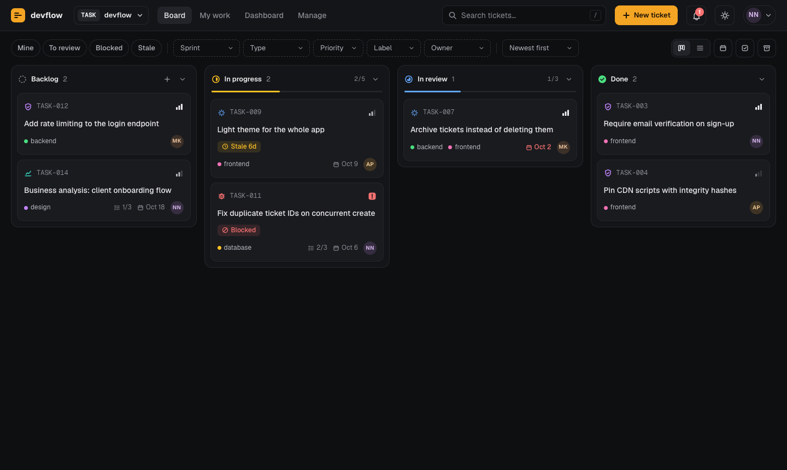
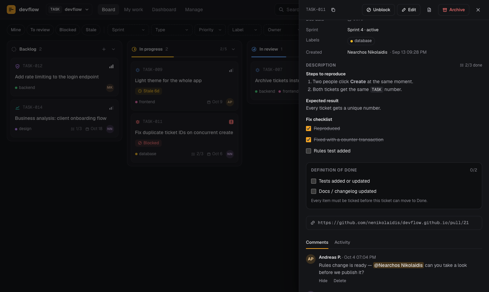
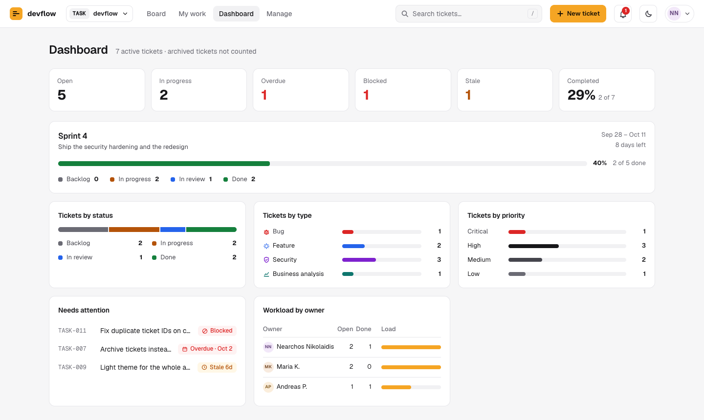
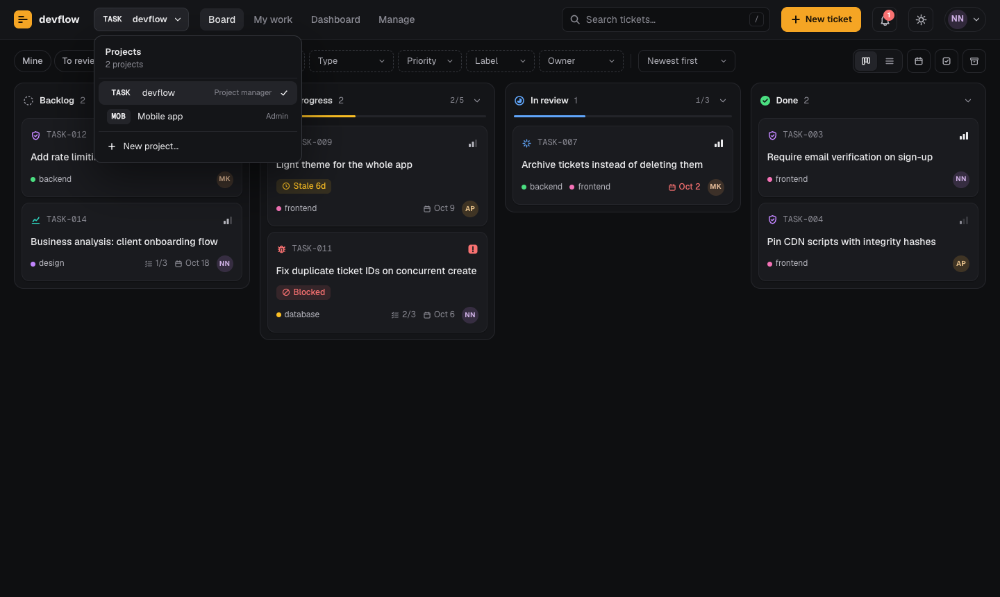
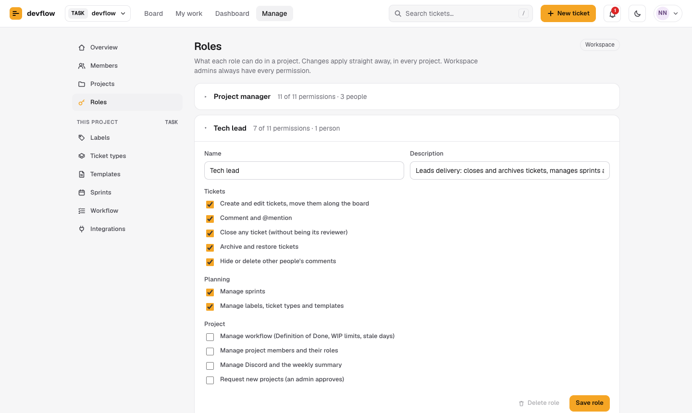

# devflow — ticket tracking for development teams

**Plan, track and ship software work: projects, tickets, sprints and code reviews on a real-time board, with roles and security built in.**

I built devflow to run day-to-day work on a development team: tickets move through a short, enforced workflow, everyone sees changes instantly, and the people who should approve work are the only ones who can close it. It runs entirely on Firebase's free tier and is hosted as static files, so there is no server to maintain.

**[Try the live demo →](https://devflow-board-11146.web.app/demo/)** No sign-up: it opens with a sample team and projects, and you can switch between people with different roles. It runs entirely in your browser on sample data, so nothing is saved and it can't reach any real data.



<p align="center">
  
  
</p>
<p align="center">
  
  
</p>

---

## What it does

**Plan and track work**
- **Projects** — each with its own board, ticket IDs (`WEB-001`, `APP-001`), sprints, labels, types, templates, workflow and Discord channel; switch between them from the top bar
- Kanban board — *Backlog → In progress → In review → Done* — plus a sortable table view
- Ticket **types** (Task, Bug, Feature, Security, Maintenance, Business analysis, Research — or your own), each with its own icon and colour
- Editable **templates** with a live preview, default labels and reviewers; turn any ticket into a template
- **Sprints** with goals and dates; filter the board by sprint and follow progress on the dashboard
- **Checklists** in descriptions (`- [ ] item`) that you tick right in the ticket; progress shows on the card
- **My work**: everything assigned to you, waiting for your review, or recently finished

**Keep the process honest**
- **Roles you can edit** — Project manager, Tech lead, Developer, QA / Tester, Designer, Viewer, or your own — each a set of permissions, given per project
- Admins create projects; project managers **request** them and an admin approves
- A ticket needs at least one **reviewer** (up to five) before *In review*
- Only a reviewer who isn't the owner — or a role allowed to close tickets — can move it to *Done*
- An optional **Definition of Done** every ticket must tick before it can close — for everyone, admins included
- **Work-in-progress limits**, **stale** detection and a **blocked** flag with a reason
- An **activity log** on every ticket that nobody can edit or delete
- Tickets are **archived**, not deleted, so history is never lost by accident

**Manage it in one place**
- A **Manage** area for members, projects, roles, labels, ticket types, templates, sprints, workflow and integrations — each section shown only to the roles allowed to use it

**Work together**
- Live sync: every change appears for everyone instantly
- **@mentions** in comments, with an in-app notification bell
- Optional **Discord** messages per project (new, assigned, ready for review, blocked, mentions) and a **weekly summary** posted every Monday
- Optional **email** to a ticket's new owner

**Feels good to use**
- Light and dark themes (follows your system setting), keyboard shortcuts (`?` lists them), works on phones
- Accessible: real buttons and labels, keyboard focus you can see, screen-reader announcements

All rules that matter — who can do what, and what the workflow allows — are enforced by the database, not just the UI.

---

## How it's built

| | |
|---|---|
| **Front end** | Plain HTML, CSS and JavaScript modules — no framework, no build step |
| **Data & sync** | Cloud Firestore with live listeners |
| **Sign-in** | Firebase Authentication (email + password, verified email required) |
| **Security** | Firestore security rules — 53 automated tests cover them, project by project and role by role |
| **Hosting** | Firebase Hosting with a strict Content-Security-Policy and other security headers |
| **CI/CD** | GitHub Actions: security-rules tests and end-to-end browser tests (35 steps, including the upgrade to projects, plus 9 for the public demo) on every push and pull request; deploys only when they pass |
| **Scheduled jobs** | A GitHub Actions cron job for the weekly Discord summary (no paid Firebase plan needed) |

The code is organised in layers — `core/` (no database code), `data/` (all Firestore access), `features/` (one file per screen) — and every piece of user content goes through an auto-escaping HTML template, so it can never run as code.

---

## Documentation

| Read this | If you want to… |
|---|---|
| **[GUIDE.md](GUIDE.md)** | use devflow day to day — projects, tickets, workflow, sprints, mentions, Manage, shortcuts |
| **[SETUP.md](SETUP.md)** | run your own copy for your team (about 30 minutes) |
| **[SECURITY.md](SECURITY.md)** | understand how it's protected, and harden your deployment |
| **[ARCHITECTURE.md](ARCHITECTURE.md)** | understand or change the code — structure, data model, conventions |

---

## Running it locally

You only need this if you want to work on the code. Requirements: [Node.js](https://nodejs.org) 20+, Java 11+ (for the Firebase emulators) and Google Chrome (for the browser test).

```bash
npm install          # development tools only — nothing here is deployed
npm test             # security-rules tests + end-to-end browser test
npm run emulators    # local, throwaway Firebase (Auth + Firestore)
npm run serve        # then open http://localhost:5050/?emulators
```

With `?emulators` in the address the app talks to the local emulators, so you can't touch real data.

---

## License

[MIT](LICENSE.md) © 2026 Nearchos Nikolaidis. You're welcome to use, adapt and build on devflow; please keep the copyright notice.
